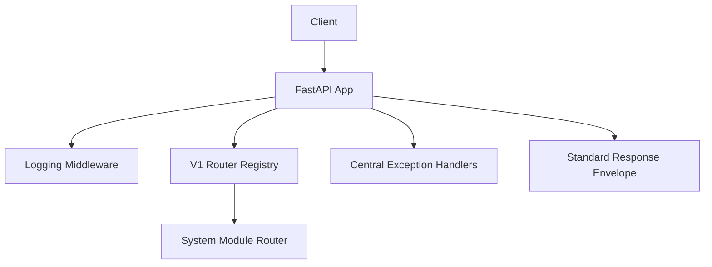

# FastAPI Framework

## Overview

Reusable FastAPI framework template for bootstrapping API services quickly.

Responsibilities:

- Provide a clean API baseline with versioned routing.
- Standardize responses and exception handling.
- Provide structured request/response logging.

Integration:

- Upstream: frontend clients or API consumers call HTTP endpoints.

## Resources

- Functional Requirements: add your project link here
- Design/Architecture: add your diagram or docs link here
- Jira Board: add your board link here

## Architecture Overview

Tech stack:

- Python 3.12+
- FastAPI
- Pydantic Settings
- Loguru

Framework architecture:



Key folders:

- app/main.py: app composition, middleware, and top-level routes
- app/api/v1/router.py: v1 module registry and route composition
- app/api/v1/endpoints/: module routers (system plus template)
- app/core/: config and logger
- app/middleware/: logging middleware

## Development Setup

### Prerequisites

- Python 3.12+
- uv

### 1) Environment setup

Copy env template:

```bash
cp .env.example .env
```

### 2) Install dependencies

```bash
uv venv
source .venv/bin/activate
uv sync
```

## Running the Application

Start server:

```bash
uv run uvicorn app.main:app --reload
```

URLs:

- API root: http://localhost:8000/
- Health: http://localhost:8000/health
- OpenAPI docs: http://localhost:8000/docs

## Testing and Validation

Run quick module compile check:

```bash
uv run python -m compileall app
```

Run app import check:

```bash
uv run python -c "from app.main import app; print(app.title)"
```

## Router and Module Template

This framework uses a module registry pattern in app/api/v1/router.py.

To add a new module:

1. Copy app/api/v1/endpoints/module_template.py into a new endpoint file.
2. Replace template handlers with module-specific logic.
3. Register the module router in the module_registry list in app/api/v1/router.py.

Recommended endpoint pattern:

- Keep HTTP concerns in endpoint modules.
- Return responses through response_helper.

## Deployment and CI/CD

Suggested baseline:

- main branch for production-ready changes
- pull request checks for lint/type/test/compile
- environment-specific .env values in your deployment platform

Add your pipeline link and deployment strategy here once selected.
